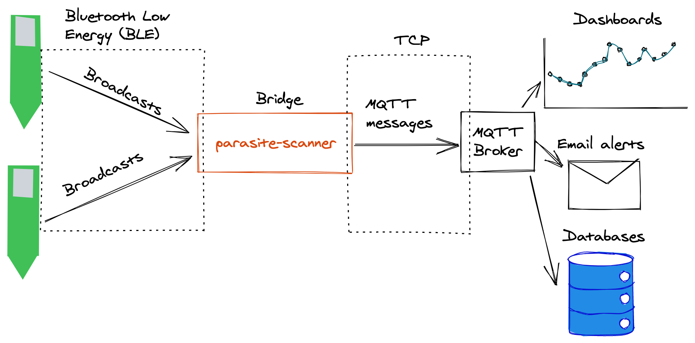

`parasite-scanner` is a Bluetooth Low Energy (BLE) - MQTT bridge for [b-parasites](https://github.com/rbaron/b-parasite). It keeps listening to BLE advertisements from b-parasites, parses the soil moisture, ambient temperature/humidity, battery voltage and publishes that data to MQTT topics. It integrates with [Home Assistant](https://www.home-assistant.io/) via automatic [MQTT discovery](https://www.home-assistant.io/docs/mqtt/discovery/).

It's made for running under Linux, with Raspberry Pis in mind, but it also works on macOS (see the `macos` entry in the config section below for a caveat).

# Configuration
`parasite-scanner` reads its config from an YAML file, specificied by the `-config` command line switch.

## A simple example
```yaml
mqtt:
  host: raspberrypi:1883
  username: mqttuser
  password: mqttpassword
  client_id: parasite-scanner
  auto_discovery: true
  registry:
    "f0:ca:f0:ca:00:01":
      name: "Office Parasite"
    "f0:ca:f0:ca:f0:02":
      name: "Lime tree"
```

## All options
From [example_config.yaml](./example_config.yaml):
```yaml
mqtt:
  host: raspberrypi:1883
  username: mqttuser
  password: mqttpassword
  client_id: parasite-scanner
  # If `auto_discovery` is enabled, an MQTT message will be published (retained)
  # to the homeassistant/sensor/parasite-scanner/<sensor_name_and_type>/config,
  # so it's automatically discoverable by Home Assistant (according to
  # https://www.home-assistant.io/docs/mqtt/discovery/).
  auto_discovery: true
prometheus:
    host: 0.0.0.0:9265
ble:
  vendor_prefix: A4:C1:38
  # macOS hides the real MAC address from BLE peripherals, and instead assign
  # discovered devices a UUID. This UUID is not guaranteed to be stable, but
  # in practice it doesn't seem to change frequently. You could find this
  # UUID and use it in place of the MAC address.
  # As an alternative, b-parasite encodes its own MAC address in its BLE
  # advertisement packet, so we can use that data instead. This is what happens
  # when `infer_mac_address` is set to `true`.
  # On Linux, none of this is necessary, since we have access to the real MAC
  # addresses of peripherals.
  macos:
    infer_mac_address: false
device:
  # `registry` maps MAC addresses to devices' MQTT configuration. For now, the only
  # configuration is `name`, and the MQTT topics will be derived from it.
  # For example, for a device with name "Office parasite", the following topics will
  # be derived:
  # - parasite-scanner/sensor/office_parasite_soil_moisture/state
  # - parasite-scanner/sensor/office_parasite_temperature/state
  # - parasite-scanner/sensor/office_parasite_humidity/state
  # - parasite-scanner/sensor/office_parasite_battery_voltage/state
  # - parasite-scanner/sensor/office_parasite_rssi/state
  registry:
    "f0:ca:f0:ca:00:01":
      name: "Office Parasite"
    "f0:ca:f0:ca:f0:02":
      name: "Lime tree"
```

# UI
Normally, `parasite-scanner` will run in the background, continuously listening for interesting BLE data and being silently successful on its job.

By using the `-ui` command line switch, it will render a terminal-based UI that is helpful for debugging, besides looking super cool. It will automatically discover BLE advertisements that look like b-parasite data and plot them over time. You can type `j` and `k` to scroll through the different discovered b-parasites. In this mode, log messages that would normally go to `stdout` will be redirected to the `parasite-scanner.log` file.

In the sped up recording below, you can see a total of 9 devices being discovered and their sensor values over time:
[](https://asciinema.org/a/uxCCdWJCRPnm8yM8FKyROdLKo)

# Installation
## Build from source
Requires Go >= 1.13
```bash
$ git clone git@github.com:rbaron/parasite-scanner
$ cd parasite-scanner
$ GOOS=linux GOARCH=arm GOARM=7 go build -o parasite-scanner .
```

# Usage
```bash
$ ./parasite-scanner -help
Usage of ./parasite-scanner:
  -config string
    	YAML config filename (default "config.yaml")
  -ui
    	renders a terminal-based ui for iteractive use

$ ./parasite-scanner -config example-config.yaml
```

# Alternative, ESP32-Based Bridge
While `parasite-scanner` is aimed at Linux & macOS, another b-parasite BLE-MQTT bridge exists for the beloved [ESP32](https://www.espressif.com/en/products/socs/esp32) microcontroller.


Support for b-parasite [has been merged into ESPHome](https://github.com/esphome/esphome/pull/1666), a battle-tested, flexible firmware for the ESP32 family. The `b_parasite` platform turns a ESP32 into a BLE-MQTT bridge for b-parasites.